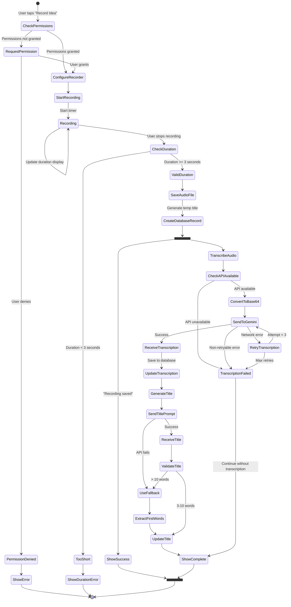

# IdeaFlow MVP - UML Activity Diagram

Shows the complete workflow from recording to saving an idea with parallel AI processing.

```mermaid
stateDiagram-v2
    [*] --> CheckPermissions: User taps "Record Idea"

    CheckPermissions --> RequestPermission: Permissions not granted
    CheckPermissions --> ConfigureRecorder: Permissions granted

    RequestPermission --> PermissionDenied: User denies
    RequestPermission --> ConfigureRecorder: User grants

    PermissionDenied --> ShowError
    ShowError --> [*]

    ConfigureRecorder --> StartRecording
    StartRecording --> Recording: Start timer

    Recording --> Recording: Update duration display
    Recording --> CheckDuration: User stops recording

    CheckDuration --> TooShort: Duration < 3 seconds
    CheckDuration --> ValidDuration: Duration >= 3 seconds

    TooShort --> ShowDurationError
    ShowDurationError --> [*]

    ValidDuration --> SaveAudioFile
    SaveAudioFile --> CreateDatabaseRecord: Generate temp title

    state fork_state <<fork>>
    CreateDatabaseRecord --> fork_state

    fork_state --> TranscribeAudio
    fork_state --> ShowSuccess: "Recording saved"

    TranscribeAudio --> CheckAPIAvailable
    CheckAPIAvailable --> ConvertToBase64: API available
    CheckAPIAvailable --> TranscriptionFailed: API unavailable

    ConvertToBase64 --> SendToGemini
    SendToGemini --> ReceiveTranscription: Success
    SendToGemini --> RetryTranscription: Network error
    SendToGemini --> TranscriptionFailed: Non-retryable error

    RetryTranscription --> SendToGemini: Attempt < 3
    RetryTranscription --> TranscriptionFailed: Max retries

    ReceiveTranscription --> UpdateTranscription: Save to database

    UpdateTranscription --> GenerateTitle
    GenerateTitle --> SendTitlePrompt
    SendTitlePrompt --> ReceiveTitle: Success
    SendTitlePrompt --> UseFallback: API fails

    UseFallback --> ExtractFirstWords
    ExtractFirstWords --> UpdateTitle

    ReceiveTitle --> ValidateTitle
    ValidateTitle --> UpdateTitle: 3-10 words
    ValidateTitle --> UseFallback: > 10 words

    UpdateTitle --> ShowComplete
    TranscriptionFailed --> ShowComplete: Continue without transcription

    state join_state <<join>>
    ShowSuccess --> join_state
    ShowComplete --> join_state

    join_state --> [*]
```
