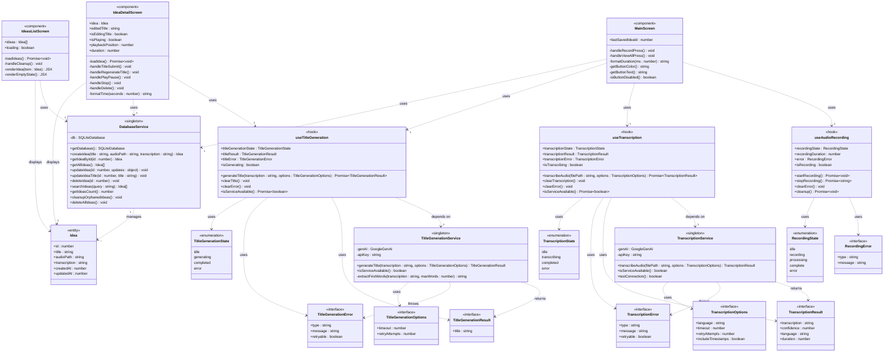

# IdeaFlow MVP - UML Class Diagram

Shows the application architecture with MVVM-like pattern: screens, hooks, services, and data models.

```mermaid
classDiagram
    %% Core Data Model
    class Idea {
        <<entity>>
        +id : number
        +title : string
        +audioPath : string
        +transcription : string
        +createdAt : number
        +updatedAt : number
    }

    %% Database Service
    class DatabaseService {
        <<singleton>>
        -db : SQLiteDatabase
        +getDatabase() SQLiteDatabase
        +createIdea(title : string, audioPath : string, transcription : string) Idea
        +getIdeaById(id : number) Idea
        +getAllIdeas() Idea[]
        +updateIdea(id : number, updates : object) void
        +updateIdeaTitle(id : number, title : string) void
        +deleteIdea(id : number) void
        +searchIdeas(query : string) Idea[]
        +getIdeasCount() number
        +cleanupOrphanedIdeas() void
        +deleteAllIdeas() void
    }

    %% Transcription Service
    class TranscriptionService {
        <<singleton>>
        -genAI : GoogleGenAI
        -apiKey : string
        +transcribeAudio(filePath : string, options : TranscriptionOptions) TranscriptionResult
        +isServiceAvailable() boolean
        +testConnection() boolean
    }

    class TranscriptionResult {
        <<interface>>
        +transcription : string
        +confidence : number
        +language : string
        +duration : number
    }

    class TranscriptionError {
        <<interface>>
        +type : string
        +message : string
        +retryable : boolean
    }

    class TranscriptionOptions {
        <<interface>>
        +language : string
        +timeout : number
        +retryAttempts : number
        +includeTimestamps : boolean
    }

    %% Title Generation Service
    class TitleGenerationService {
        <<singleton>>
        -genAI : GoogleGenAI
        -apiKey : string
        +generateTitle(transcription : string, options : TitleGenerationOptions) TitleGenerationResult
        +isServiceAvailable() boolean
        -extractFirstWords(transcription : string, maxWords : number) string
    }

    class TitleGenerationResult {
        <<interface>>
        +title : string
    }

    class TitleGenerationError {
        <<interface>>
        +type : string
        +message : string
        +retryable : boolean
    }

    class TitleGenerationOptions {
        <<interface>>
        +timeout : number
        +retryAttempts : number
    }

    %% Custom Hooks
    class useAudioRecording {
        <<hook>>
        +recordingState : RecordingState
        +recordingDuration : number
        +error : RecordingError
        +isRecording : boolean
        +startRecording() Promise~void~
        +stopRecording() Promise~string~
        +clearError() void
        +cleanup() Promise~void~
    }

    class RecordingError {
        <<interface>>
        +type : string
        +message : string
    }

    class useTranscription {
        <<hook>>
        +transcriptionState : TranscriptionState
        +transcriptionResult : TranscriptionResult
        +transcriptionError : TranscriptionError
        +isTranscribing : boolean
        +transcribeAudio(filePath : string, options : TranscriptionOptions) Promise~TranscriptionResult~
        +clearTranscription() void
        +clearError() void
        +isServiceAvailable() Promise~boolean~
    }

    class useTitleGeneration {
        <<hook>>
        +titleGenerationState : TitleGenerationState
        +titleResult : TitleGenerationResult
        +titleError : TitleGenerationError
        +isGenerating : boolean
        +generateTitle(transcription : string, options : TitleGenerationOptions) Promise~TitleGenerationResult~
        +clearTitle() void
        +clearError() void
        +isServiceAvailable() Promise~boolean~
    }

    %% Screen Components
    class MainScreen {
        <<component>>
        +lastSavedIdeaId : number
        -handleRecordPress() void
        -handleViewAllPress() void
        -formatDuration(ms : number) string
        -getButtonColor() string
        -getButtonText() string
        -isButtonDisabled() boolean
    }

    class IdeasListScreen {
        <<component>>
        +ideas : Idea[]
        +loading : boolean
        -loadIdeas() Promise~void~
        -handleCleanup() void
        -renderIdea(item : Idea) JSX
        -renderEmptyState() JSX
    }

    class IdeaDetailScreen {
        <<component>>
        +idea : Idea
        +editedTitle : string
        +isEditingTitle : boolean
        +isPlaying : boolean
        +playbackPosition : number
        +duration : number
        -loadIdea() Promise~void~
        -handleTitleSubmit() void
        -handleRegenerateTitle() void
        -handlePlayPause() void
        -handleStop() void
        -handleDelete() void
        -formatTime(seconds : number) string
    }

    %% State Enums
    class RecordingState {
        <<enumeration>>
        idle
        recording
        processing
        complete
        error
    }

    class TranscriptionState {
        <<enumeration>>
        idle
        transcribing
        completed
        error
    }

    class TitleGenerationState {
        <<enumeration>>
        idle
        generating
        completed
        error
    }

    %% Relationships - Data Access Layer
    DatabaseService "1" ..> "*" Idea : manages

    %% Relationships - Service Layer Dependencies
    TranscriptionService ..> TranscriptionResult : returns
    TranscriptionService ..> TranscriptionError : throws
    TranscriptionService ..> TranscriptionOptions : uses
    TitleGenerationService ..> TitleGenerationResult : returns
    TitleGenerationService ..> TitleGenerationError : throws
    TitleGenerationService ..> TitleGenerationOptions : uses

    %% Relationships - Hook Layer Dependencies
    useAudioRecording ..> RecordingError : uses
    useAudioRecording ..> RecordingState : uses

    useTranscription ..> "1" TranscriptionService : depends on
    useTranscription ..> TranscriptionResult : uses
    useTranscription ..> TranscriptionError : uses
    useTranscription ..> TranscriptionState : uses

    useTitleGeneration ..> "1" TitleGenerationService : depends on
    useTitleGeneration ..> TitleGenerationResult : uses
    useTitleGeneration ..> TitleGenerationError : uses
    useTitleGeneration ..> TitleGenerationState : uses

    %% Relationships - Presentation Layer Dependencies
    MainScreen ..> "1" useAudioRecording : uses
    MainScreen ..> "1" useTranscription : uses
    MainScreen ..> "1" useTitleGeneration : uses
    MainScreen ..> "1" DatabaseService : uses

    IdeasListScreen ..> "1" DatabaseService : uses
    IdeasListScreen ..> "*" Idea : displays

    IdeaDetailScreen ..> "1" useTitleGeneration : uses
    IdeaDetailScreen ..> "1" DatabaseService : uses
    IdeaDetailScreen ..> "1" Idea : displays
```
