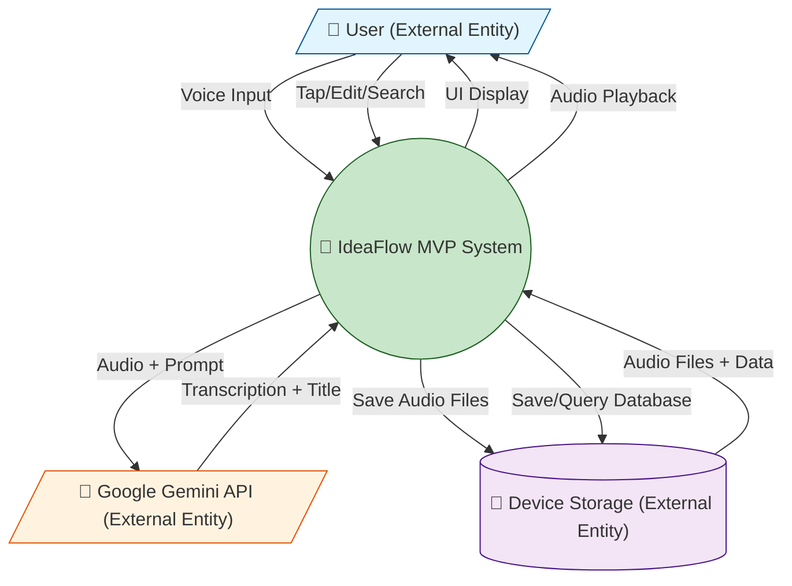

# IdeaFlow MVP - Data Flow Diagram

Shows how data moves through the system between user, external services, and storage.

```mermaid
graph TB
    User[/"👤 User (External Entity)"/]
    System(("🎯 IdeaFlow MVP System"))
    Gemini[/"🤖 Google Gemini API (External Entity)"/]
    FileSystem[("💾 Device Storage (External Entity)")]

    User -->|Voice Input| System
    User -->|Tap/Edit/Search| System
    System -->|UI Display| User
    System -->|Audio Playback| User

    System -->|Audio + Prompt| Gemini
    Gemini -->|Transcription + Title| System

    System -->|Save Audio Files| FileSystem
    System -->|Save/Query Database| FileSystem
    FileSystem -->|Audio Files + Data| System

    style User fill:#e1f5ff,stroke:#01579b
    style Gemini fill:#fff3e0,stroke:#e65100
    style FileSystem fill:#f3e5f5,stroke:#4a148c
    style System fill:#c8e6c9,stroke:#1b5e20
```
