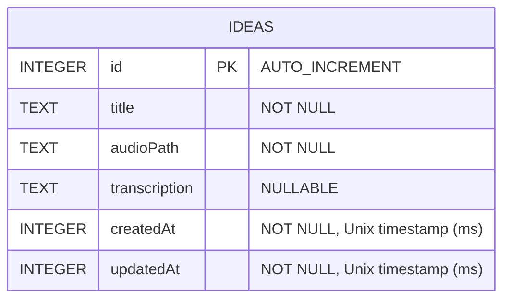

# IdeaFlow MVP - Entity-Relationship Diagram

Shows the database schema with the single IDEAS entity and its attributes.

```mermaid
erDiagram
    IDEAS {
        INTEGER id PK "AUTO_INCREMENT"
        TEXT title "NOT NULL"
        TEXT audioPath "NOT NULL"
        TEXT transcription "NULLABLE"
        INTEGER createdAt "NOT NULL, Unix timestamp (ms)"
        INTEGER updatedAt "NOT NULL, Unix timestamp (ms)"
    }
```
