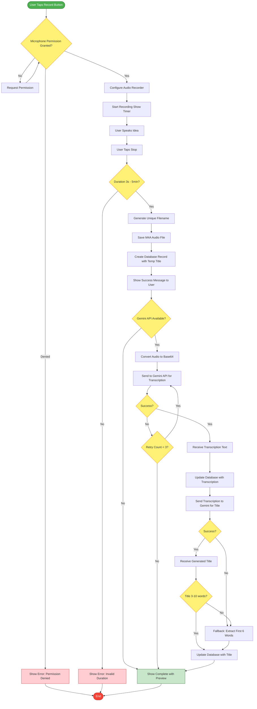

# IdeaFlow MVP - Flowchart

Complete workflow for recording and processing a new idea from start to finish.

```mermaid
flowchart TD
    Start([User Taps Record Button])

    CheckPerm{Microphone Permission Granted?}
    RequestPerm[Request Permission]
    PermDenied[Show Error: Permission Denied]

    Configure[Configure Audio Recorder]
    StartRec[Start Recording Show Timer]
    Recording[User Speaks Idea]
    StopRec[User Taps Stop]

    CheckDuration{Duration 3s - 5min?}
    DurationError[Show Error: Invalid Duration]

    GenerateFilename[Generate Unique Filename]
    SaveAudio[Save M4A Audio File]
    CreateRecord[Create Database Record with Temp Title]
    ShowSuccess[Show Success Message to User]

    CheckAPI{Gemini API Available?}
    ConvertBase64[Convert Audio to Base64]
    SendTranscription[Send to Gemini API for Transcription]

    TranscribeSuccess{Success?}
    Retry{Retry Count < 3?}

    ReceiveTranscription[Receive Transcription Text]
    UpdateTranscription[Update Database with Transcription]

    SendTitle[Send Transcription to Gemini for Title]
    TitleSuccess{Success?}

    ReceiveTitle[Receive Generated Title]
    ValidateTitle{Title 3-10 words?}

    FallbackTitle[Fallback: Extract First 6 Words]
    UpdateTitle[Update Database with Title]

    Complete[Show Complete with Preview]
    End([End])

    Start --> CheckPerm
    CheckPerm -->|No| RequestPerm
    RequestPerm --> CheckPerm
    CheckPerm -->|Denied| PermDenied
    PermDenied --> End

    CheckPerm -->|Yes| Configure
    Configure --> StartRec
    StartRec --> Recording
    Recording --> StopRec

    StopRec --> CheckDuration
    CheckDuration -->|No| DurationError
    DurationError --> End

    CheckDuration -->|Yes| GenerateFilename
    GenerateFilename --> SaveAudio
    SaveAudio --> CreateRecord
    CreateRecord --> ShowSuccess

    ShowSuccess --> CheckAPI
    CheckAPI -->|No| Complete
    CheckAPI -->|Yes| ConvertBase64

    ConvertBase64 --> SendTranscription
    SendTranscription --> TranscribeSuccess

    TranscribeSuccess -->|No| Retry
    Retry -->|Yes| SendTranscription
    Retry -->|No| Complete

    TranscribeSuccess -->|Yes| ReceiveTranscription
    ReceiveTranscription --> UpdateTranscription
    UpdateTranscription --> SendTitle

    SendTitle --> TitleSuccess
    TitleSuccess -->|No| FallbackTitle
    TitleSuccess -->|Yes| ReceiveTitle

    ReceiveTitle --> ValidateTitle
    ValidateTitle -->|No| FallbackTitle
    ValidateTitle -->|Yes| UpdateTitle

    FallbackTitle --> UpdateTitle
    UpdateTitle --> Complete
    Complete --> End

    style Start fill:#4caf50,stroke:#1b5e20,color:#fff
    style End fill:#f44336,stroke:#b71c1c,color:#fff
    style CheckPerm fill:#fff176,stroke:#f57f17
    style CheckDuration fill:#fff176,stroke:#f57f17
    style CheckAPI fill:#fff176,stroke:#f57f17
    style TranscribeSuccess fill:#fff176,stroke:#f57f17
    style Retry fill:#fff176,stroke:#f57f17
    style TitleSuccess fill:#fff176,stroke:#f57f17
    style ValidateTitle fill:#fff176,stroke:#f57f17
    style PermDenied fill:#ffcdd2,stroke:#c62828
    style DurationError fill:#ffcdd2,stroke:#c62828
    style Complete fill:#c8e6c9,stroke:#1b5e20
```
