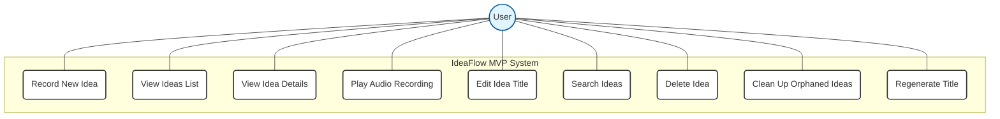

# IdeaFlow MVP - UML Use Case Diagram

Shows the functional capabilities of the IdeaFlow MVP system from the user's perspective.

```mermaid
graph TB
    User((User))

    subgraph "IdeaFlow MVP System"
        UC1(Record New Idea)
        UC2(View Ideas List)
        UC3(View Idea Details)
        UC4(Play Audio Recording)
        UC5(Edit Idea Title)
        UC6(Search Ideas)
        UC7(Delete Idea)
        UC8(Clean Up Orphaned Ideas)
        UC9(Regenerate Title)
    end

    User --- UC1
    User --- UC2
    User --- UC3
    User --- UC4
    User --- UC5
    User --- UC6
    User --- UC7
    User --- UC8
    User --- UC9

    style User fill:#e1f5ff,stroke:#01579b,stroke-width:2px
    style UC1 fill:#fff,stroke:#333,stroke-width:2px
    style UC2 fill:#fff,stroke:#333,stroke-width:2px
    style UC3 fill:#fff,stroke:#333,stroke-width:2px
    style UC4 fill:#fff,stroke:#333,stroke-width:2px
    style UC5 fill:#fff,stroke:#333,stroke-width:2px
    style UC6 fill:#fff,stroke:#333,stroke-width:2px
    style UC7 fill:#fff,stroke:#333,stroke-width:2px
    style UC8 fill:#fff,stroke:#333,stroke-width:2px
    style UC9 fill:#fff,stroke:#333,stroke-width:2px
```
